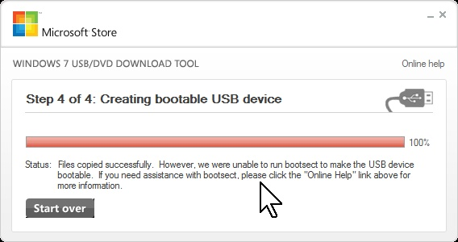
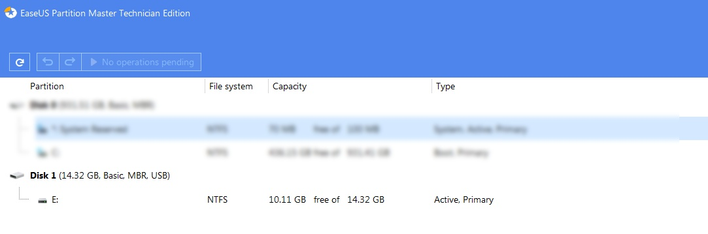

the source from http://go.microsoft.com/fwlink/?LinkId=218888
or https://www.microsoft.com/en-us/download/confirmation.aspx?id=56485&6B49FDFB-8E5B-4B07-BC31-15695C5A2143=1
or https://download.microsoft.com/download/C/4/8/C48F6E20-FE20-41C6-8C1C-408FE7B49A3A/Windows7-USB-DVD-Download-Tool-Installer-en-US.exe

 
 

 

For more information about the Windows 7 USB/DVD Download Tool, please see 
http://store.microsoft.com/help/ISO-Tool. 

The Windows 7 USD/DVD Download Tool uses material from ImageMaster, a .NET C#
application for reading and writing disc images (*.iso files).  ImageMaster 
is licensed under the terms of the GPL.  For more information about ImageMaster,
please see http://imagemaster.codeplex.com/.

This project uses the WIX Votive plugin for Visual Studio 2008.  Please see
http://wix.sourceforge.net/votive.html for installation instructions.

To build in Visual Studio 2008:

1. Make desired changes to the source code.

2. Copy the wudtsource.zip file to the same directory as the .sln file.

3. Build the project in Visual Studio.

To create localized installers and self-extracting files:

1. Build the project as described above.

2. Run the Install\CreateLocalizedInstallers.cmd script to create the 
   localized MSI installers.

To bypass formatting the USB device within the tool:

1. Ensure the registry key "HKCU\SOFTWARE\Microsoft\ISO Backup Tool" is created.

2. Create a new DWORD value named "DisableFormat" in this location and set the value to 1.

NOTE: The USB device should be formatted manually before running the tool.

known issue and solution - <strong>bootsect.exe</strong>
this application will format (unless you specify the above registry DWORD) the drive to a NTFS partiton (using MBR - - - not GPT+UEFI), 
when using it to set a USB, the programs tries to use its own personal version of <code>bootsect.exe</code> (embedded in the exe as a binary resource, copied to your <code>%TEMP%</code> folder),  
but sometimes it will fail if it can not find <code>api-ms-win-core-heap-obsolete-l1-1-0.dll</code>,  
known as <code>StatusBootloaderError</code>, with the message:  
<pre>
Files copied successfully.  However, we were unable to run bootsect to make the USB device bootable.  If you need assistance with bootsect, please click the "Online Help" link above for more information.
</pre>

  

open CMD as admin and change-directory to the <code>/_resources_and_bootsect_exe/</code> folder, it has binaries (which were taken from <code>C:\Program Files (x86)\EaseUS\EaseUS Partition Master 14.0\DC\bin</code> - by the way..), and simply try running the command (<strong>replace Z: with your actual USB-drive letter, be very carful!!!</strong>):  
<code>call "bootsect.exe" /nt60 Z: /force /mbr</code>

you will get someting like this:  

<pre>
Target volumes will be updated with BOOTMGR compatible bootcode.

Z: (\\?\Volume{01234567-890a-bcde-f012-3456789abcde})

    Successfully updated NTFS filesystem bootcode.

\??\PhysicalDrive1

    Successfully updated disk bootcode.

Bootcode was successfully updated on all targeted volumes.
</pre>

and if you'll open up any partition manager program you will see that the USB drive is set to active  

  
